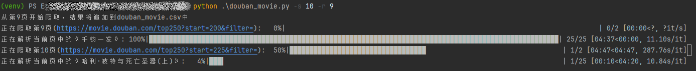
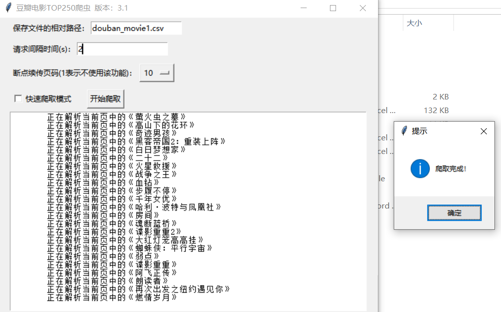

# Douban Movie Top-250 Crawler

豆瓣电影 Top 250 爬虫

  

## Description

This script is used to crawl the movie information of Douban Movie Top-250, including movie name, movie link, director, starring, release time, production country/region, type, rating, number of reviews and introduction.
豆瓣电影 Top-250 爬虫，爬取豆瓣电影 Top-250 的电影信息，包括电影名称、电影链接、导演、主演、上映时间、制片国家/地区、类型、评分、评价人数、简介等信息。

## Features

- Support command line interface and GUI interface;
- Support fast mode, get director and actor information from the top-250 list page directly;
- Support resume from the specified page;
- Support saving data to csv file;
- Support setting sleep time between requests.

---

- 支持命令行界面和 GUI 界面；
- 支持快速模式，直接从 Top-250 列表页获取导演和演员信息；
- 支持从指定页码开始爬取；
- 支持保存数据到 csv 文件；
- 支持设置请求间隔时间。

## Requirements

- Python 3.6+
- requests~=2.31.0
- beautifulsoup4~=4.12.3
- lxml~=5.2.1
- tqdm~=4.66.2

## Usage

`douban_movie.py [-h] [-p PATH] [-s SLEEP] [-r {1,2,3,4,5,6,7,8,9,10}] [-f] [-g] [-v]`

example:
- `python douban_movie.py -p data.csv -s 5 -r 4 -f`: 将数据保存到 data.csv 文件中，每次请求间隔 5 秒，从第 4 页开始爬取，使用快速模式
- `python douban_movie.py -g`: 使用 GUI 界面
- `python douban_movie.py -v`: 显示版本信息

optional arguments:
```
-h, --help            show this help message and exit
-p PATH, --path PATH  Relative path to save the csv file
-s SLEEP, --sleep SLEEP
                      Sleep time between requests(unit: s)
-r {1,2,3,4,5,6,7,8,9,10}, --resume {1,2,3,4,5,6,7,8,9,10}
                      Resume from the specified page, value=1: no resume; in [2, 10]: normal resume
-f, --fast            Fast mode, get director and actor information from the top-250 list page directly
-g, --gui             Use GUI interface
-v, --version         show program's version number and exit
```

## Screenshots

### Command Line Interface

“断点续爬”功能 Resume from the specified page:




修改请求间隔时间&快速模式 Sleep time between requests&Fast mode:


帮助&版本信息 Help&Version:


### GUI Interface


